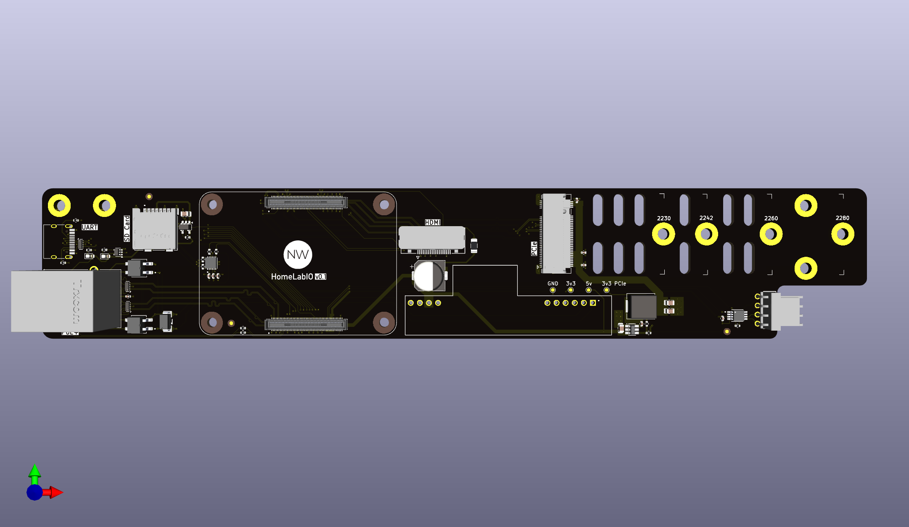

# HomeLabIO

`HomeLabIO` is a Compute Module 4 carrier board designed to fit in a 19" rack using 1U of space.

## Why

This is my first attempt at making a PCB and was largely a practical learning experience, and
I do not suggest you fabricate this yourself. There are better projects on the market made by
talented people who know what they are doing.

The schematic is heavily inspired by the [Raspberry Pi CM4IO](https://datasheets.raspberrypi.com/cm4io/cm4io-datasheet.pdf)
and the [HomeAssistant Yellow](https://github.com/NabuCasa/yellow). 

## Fabrication

This board was fabricated with (JLCPCB)[https://jlcpcb.com/], and all the parts contain their part numbers. The Gerbers, BOM and placement
files can be found attached to each release.

## Testing

`v0.1.0` has been fabricated and tested. Everything works with exception of the UART FTDI, which has a wiring issue. This
issue has been corrected in `v0.1.1` but not yet fabricated.
