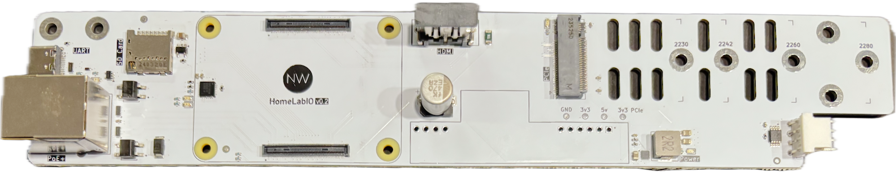

# HomeLabIO

`HomeLabIO` is a Compute Module 4/5 carrier board designed to fit in a 19" rack using 1U of space.

[Interactive BOM](https://htmlpreview.github.io/?https://github.com/nrwiersma/homelabio/blob/TPM2/bom/ibom.html) [(provided by InteractiveHtmlBom)
](https://github.com/openscopeproject/InteractiveHtmlBom)

Features:

* Power over Ethernet 802.3at (PoE+)
* TPM 2.0
* NVMe SSD up to 2280
* HDMI
* USB-C UART communication on the front
* PWM fan

## Why

This is my first attempt at making a PCB and was largely a practical learning experience.

The schematic is heavily inspired by the [Raspberry Pi CM4IO](https://datasheets.raspberrypi.com/cm4io/cm4io-datasheet.pdf)
and the [HomeAssistant Yellow](https://github.com/NabuCasa/yellow). 

## Config

### Fan

## PCB Fabrication and Assembly by PCBWay

I am proudly sponsored by [PCBWay](https://www.pcbway.com/), a leading manufacturer specializing in PCB prototyping, 
low-volume production, and PCB Assembly services. Thanks to PCBWay’s sponsorship, I was able to fabricate and assemble 
my PCBs with high precision and quality. Their advanced manufacturing capabilities ensured that our design was 
translated into a robust and functional product.

### Why PCBWay?

PCBWay offers:

* **High-quality PCB fabrication** with multiple layer options, surface finishes, and material choices.
* **Fast turnaround times** to meet project deadlines efficiently.
* **Affordable pricing** for both prototyping and mass production.
* **Reliable PCB assembly services**, including SMT, through-hole, and mixed assembly.
* **Exceptional customer support** and a user-friendly ordering platform.

### Get Your Own PCBs from PCBWay

I highly recommend PCBWay for all your PCB fabrication and assembly needs. Their dedication to quality and customer 
satisfaction makes them an ideal partner for your projects. If you're looking for a trusted partner for PCB fabrication 
and assembly, check out PCBWay for your next project.

Special thanks to PCBWay for their generous support!

## Changelog

#### v0.1.0

* Initial schematic and board

#### v0.1.1

* Fix issue with FTDI USB connection
* Fix issue with BOM that specifies a generic fuse

#### v0.2.0

* Move fan port closer to board edge
* Switch UART chipset
* Add UART activity LEDs
* Switch PCIe power management
* Add NVMe LED
* Switch HDMI port for cheaper alternative
